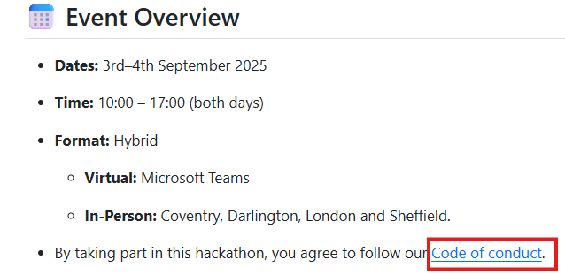
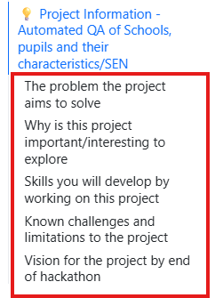
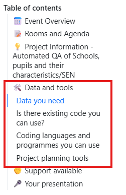
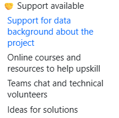

## Welcome to the pre-stats awayday hackathon!

::::: columns
::: {.column width="60%"}
-   Welcome everyone! We're thrilled to have you here!

-   Get ready for 2 days of upskilling, creativity, collaboration, and innovation.

-   Over the next two days, you will be working on a project that you will present here and in the stats awayday on the 11th of September.
:::

::: {.column width="40%"}

:::
:::::

## Meet the organisers and volunteers {.smaller}

::: panel-tabset
### Organisers

|                  |
|------------------|
| Menna Zayed      |
| Charlotte Foster |
| Matthew Robinson |

### Data background / Subject expert volunteers



### Technical volunteers


:::

## Your teams and projects


::: panel-tabset

## Persistent Absence Explorer

| Persistent Absence Explorer |              |
|-----------------------------|--------------|
| **Team member**             | **Location** |
| Grace TAYLOR-JOYCE          | Coventry     |
| Robert TARRANT              | London       |
| Finn TRINCI                 | London       |
|                             |              |

## Form-to-Report Generator

| Form-to-Report Generator |              |
|--------------------------|--------------|
| **Team member**          | **Location** |
| Sarah M-BRIGHT           | London       |
| Cheena GHATAOURA         | London       |
| Rebecca WEDGE-ROBERTS    | Sheffield    |


## Automated QA of Schools, pupils and their characteristics/SEN

| Automated QA of Schools, pupils and their characteristics/SEN |   |
|----|----|
| **Team member** | **Location** |
| Kester JARVIS | Virtual on Weds/London on Thurs |
| Nathan CHALAM-JUDGE | Sheffield |
|  |  |
|  |  |

## Using LLMs for Third-Line QA on Statistical Releases

| Using LLMs for Third-Line QA on Statistical Releases |              |
|------------------------------------------------------|--------------|
| **Team member**                                      | **Location** |
| Jake TUFTS                                           | London       |
|                                                      |              |
|                                                      |              |

## Developing a Historical School Identifier Dimension

| Developing a Historical School Identifier Dimension |              |
|-----------------------------------------------------|--------------|
| **Team member**                                     | **Location** |
| Connor BOUSFIELD                                    | Darlington   |
|                                                     |              |
|                                                     |              |
|                                                     |              |


## New Insights on User Analytics for EES

| New Insights on User Analytics for EES |              |
|----------------------------------------|--------------|
| **Team member**                        | **Location** |
| Hasan MALIK                            | Coventry     |
|                                        |              |
|                                        |              |
|                                        |              |
:::

## Hackathon Participant Guide

::::: columns
::: {.column width="60%"}
-   This guide was emailed to you before today

-   You can also find it in the Hackathon MS Team resources.

-   Check the file you have and ensure you have the correct one for your project by checking the project name next to the title.

-   It contains all the information you need to get started with your project and you can access different sections easily through the TOC.
:::

::: {.column width="40%"}

:::
:::::

## Event details and Code of conduct

:::::: columns
:::: {.column width="60%"}
-   A section that summarises the event details and links to our code of conduct.

-   Please make sure to read it and follow it as we want to create a friendly and welcoming environment for everyone.

::: callout-tip
#### **Expected Behaviour**

To help create a positive and collaborative environment, we ask all participants to:

-   Be kind, respectful, and inclusive

-   Listen actively and value different perspectives

-   Give constructive feedback and accept it graciously

-   Collaborate with curiosity and openness

-   Help foster a fun and supportive atmosphere
:::
::::

::: {.column width="40%"}

:::
::::::

## Agenda:

::::: columns
::: {.column width="40%"}
You can find the following information for both days and can be accessed through the clickable tabsets:

-   Rooms booked for each location for both days
-   Agenda for each day with details for each session and MS Teams links for the drop in sessions
:::

::: {.column width="60%"}

:::
:::::

## 📅 Day 1 – 3rd September 2025

1.  🟢**Welcome & Kickoff**

2.  🧠**Project Planning**

3.  💻 **Hacking Session #1**

4.  🍽️ **Lunch Break**

5.  💬 **Team Check-In**

6.  💻 **Hacking Session #2**

7.  ☕ **Afternoon Break**

8.  💬 **Team Check-In & Wrap-Up**

## Project information:

::::: columns
::: {.column width="60%"}
-   Make sure to read through all the project information.

-   You will find the following information in this section:

    -   The problem the project aims to solve.

    -   Skills you will develop by working on this project.

    -   Known challenges and limitations.

    -   Vision for the project by the end of the hackathon - this will help you plan your project and set expectations.
:::

::: {.column width="40%"}

:::
:::::

## Data and tools

::::: columns
::: {.column width="60%"}
Use this section for:

-   Links to pages where you can find the data you need information on how to access it.
-   Suggestions for tools you can use.
:::

::: {.column width="40%"}

:::
:::::

## Support available:

::::: columns
::: {.column width="60%"}
-   Links to DataCamp courses

-   Links to other resources

-   MS Teams and volunteers

    -   Link to the Team for the hackathon where you can post question.

    -   We encourage you to use the 'Help and Support' channel to ask questions.

    -   Volunteers will try to answer when they're available and we also encourage you to support each other.
:::

::: {.column width="40%"}

:::
:::::

## Your presentation

-   You will get to present at the end of the two day hackathon and also present at the stats awayday!

-   We provided a guided structure to help you create your presentation.

::: callout-important
The presentation should be from 5 - 10 minutes maximum. Ensure to allow time for questions at the end.
:::

## Let's get started!

1.  Set up a teams chat with your team

2.  Set up a call with your team to plan your project

3.  Decide on your project planning tool

4.  Complete the 'Meet your team!' activity. You will find it on the Miro and Lucid boards or a link to a modified version if you choose Trello instead.

::: callout-tip
## Things to consider:

```         
-   Project planning tools

-   The coding language you will use

-   Break down the project and assign parts to different members

-   How you can utilize different people's expertise while still pushing for development

-   Make sure to set up calls for the team check-ins scheduled in the agenda
```
:::
