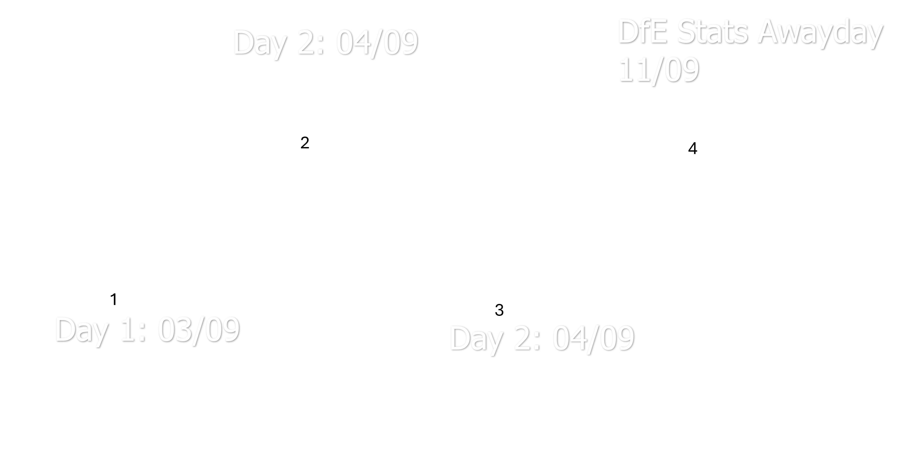
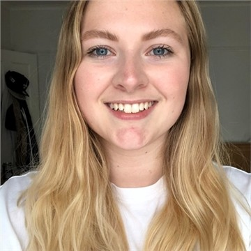
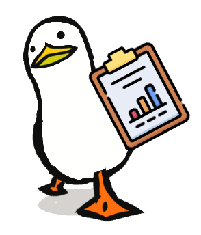
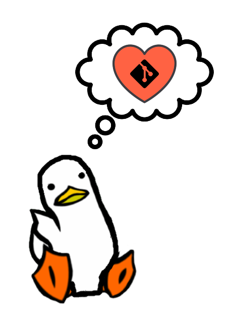

## Welcome to the pre-stats awayday hackathon!

::::: columns
::: {.column width="60%"}
-   Welcome everyone! We're thrilled to have you here!

-   Get ready for 2 days of upskilling, creativity, collaboration, and innovation.

-   Over the next two days, you will be working on a project that you will present here and in the stats awayday on the 11th of September.
:::

::: {.column width="40%"}

:::
:::::


## Overview of the hackathon



## Your presentation

::::columns
::: {.column width="60%"}
-   We provided a guided structure to help you create your presentation.

- The presentation should be from 5 - 10 minutes maximum. 

    - Ensure to allow time for questions at the end. 
    
- Please ensure at least one person from your team is available to present at the end of the hackathon and at the DfE Stats awayday.
:::
::: {.column width="40%"}

:::
::::
## Meet the organisers and volunteers {.smaller}

::: panel-tabset


### Organisers
::: {layout-nrow=2}
{fig-align="left" width=50%}

{fig-align="left" width=50%}

{fig-align="left" width=50%}
:::

### Data background / Subject expert volunteers

::: {layout-ncol=2}

{fig-align="left" width=50%}

{fig-align="left" width=50%}

:::


### Technical volunteers
::: {layout-nrow=3}

{fig-align="left" width=40%}

{fig-align="left" width=40%}

{fig-align="left" width=40%}

{fig-align="left" width=40%}

{fig-align="left" width=40%}

{fig-align="left" width=40%}

{fig-align="left" width=40%}
:::

:::

## Your teams and projects


::: panel-tabset

## Persistent Absence Explorer

::::columns
::: {.column width="40%"}
### Persistent Absence Explorer

This project aims to make it easier to analyse and compare persistent absence rates across regions and school types, using the Week 29 dataset for a full-year view. The goal is to uncover meaningful patterns and insights.

:::
::: {.column width="60%"}

| **Team member**             | **Location** |
|-----------------------------|--------------|
| Robert TARRANT              | London       |
| Finn TRINCI                 | London       |
| Kester JARVIS | Virtual on Weds/London on Thurs |
| April WORRALL               | Sheffield    |
:::
::::

## Form-to-Report Generator


::::columns
::: {.column width="40%"}
### Form-to-Report Generator

This project explores using Copilot to automatically generate reports or emails from structured data like forms or spreadsheets, saving time and ensuring consistency. A key example is turning a reward spreadsheet into personalised thank-you messages.
:::
::: {.column width="60%"}
| **Team member**          | **Location** |
|--------------------------|--------------|
| Sarah M-BRIGHT           | London       |
| Cheena GHATAOURA         | London       |
| Rebecca WEDGE-ROBERTS    | Sheffield    |
:::
::::


## Using LLMs for Third-Line QA on Statistical Releases
::::columns
::: {.column width="40%"}
### Using LLMs for Third-Line QA on Statistical Releases

This project explores whether large language models (LLMs) can help spot patterns, anomalies, or inconsistencies in statistical data that traditional QA might miss, adding an extra layer of assurance and insight.
:::
::: {.column width="60%"}

| **Team member**                                      | **Location** |
|-----------------------------|--------------|
| Jake TUFTS                           | London       |
| Nathan CHALAM-JUDGE | Sheffield |
| Hasan MALIK                            | Coventry     |
:::
::::
## Developing a Historical School Identifier Dimension

::::columns
::: {.column width="40%"}
### Developing a Historical School Identifier Dimension

This project aims to create a consistent way to track schools over time, despite changes in identifiers like URN and LAESTAB due to closures or mergers. A historical link between identifiers will support better longitudinal analysis.
:::
::: {.column width="60%"}
| **Team member**                                     | **Location** |
|-----------------------------|--------------|
| Connor BOUSFIELD                                    | Darlington   |
| Samuel PILLING                                      | London       |
| Sema TAYAR                                         |London              |

:::
::::
:::

## Hackathon Participant Guide

::::: columns
::: {.column width="60%"}
-   This guide was emailed to you before today

-   You can also find it in the Hackathon MS Team resources.

-   Check the file you have and ensure you have the correct one for your project by checking the project name next to the title.

-   It contains all the information you need to get started with your project and you can access different sections easily through the TOC.
:::

::: {.column width="40%"}

:::
:::::


## Code of conduct

:::::: columns
:::: {.column width="40%"}
-   The code of conduct for the hackathon is linked in the 'Event overview' section of your guide.

-   Please make sure to read it and follow it as we want to create a friendly and welcoming environment for everyone.


::::

::: {.column width="60%"}

:::
::::::

## Agenda

::::: columns
::: {.column width="40%"}
You can find the following information for both days and can be accessed through the clickable tabsets:

-   Rooms booked for each location for both days
-   Agenda for each day with details for each session and MS Teams links for the drop in sessions
:::

::: {.column width="60%"}

:::
:::::

## 📅 Day 1: 3rd September 2025

1.  🟢**Welcome & Kickoff**

2.  🧠**Project Planning**

3.  💻 **Hacking Session #1**

4.  🍽️ **Lunch Break**

5.  💬 **Team Check-In**

6.  💻 **Hacking Session #2**

7.  ☕ **Afternoon Break**

8.  💬 **Team Check-In & Wrap-Up**

## What's my project?
::::: columns
::: {.column width="60%"}

-   You will find this information in the project information section.

-   You will find the following information in this section:

    -   The problem the project aims to solve.

    -   Known challenges and limitations.

    -   Vision for the project by the end of the hackathon - this will help you plan your project and set expectations.

:::
::: {.column width="40%"}

:::
::::

## How do I get data?

:::: columns
::: {.column width="60%"}
Use the 'Data and tools' section in your guide to get information on how to access the data you need for your project.
:::
::: {.column width="40%"}

:::
::::

## How do I plan my project?
:::: columns
::: {.column width="60%"}
Use the 'Data and tools' section in your guide to find templates you can use for:

- Miroboard
- Lucid board
- Trello board
:::
::: {.column width="40%"}

:::
::::

## How do we collaborate on code and document?
:::: columns
::: {.column width="60%"}
- Use the 'Code sharing - GitHub' section in your guide to find links to the GitHub repository for your project.
- Using Git is the most effcient way to collaborate on writing code.
- Use the README in the repo to document your project and how to run it.
- Allows us to share your code with the team who proposed the project. 
:::
::: {.column width="40%"}

:::
::::

## How do I get help?
::::columns
::: {.column width="60%"}
-   Use the 'Support available' section in your guide to find links to resources
-   Use the [Pre-stats awayday hackathon group](https://teams.microsoft.com/l/team/19%3AmDwTrFC1t5hhuDsXfajF516hmOWTFGjgIvJcPjdCLNM1%40thread.tacv2/conversations?groupId=620ed7ec-9dc9-4ca1-bc7b-848f6bd80878&tenantId=fad277c9-c60a-4da1-b5f3-b3b8b34a82f9) group on Teams to ask questions.
:::
::: {.column width="40%"}

:::
::::
## MS Teams
::::columns
::: {.column width="60%"}
-   Use the MS Teams channel to ask questions and get help from the organisers and volunteers.
-   Select the relevant channel for your query.
-   Provide the following so the volunteers can help you:

    -   Your project name
    -   A summary of the issue you are facing
    -   Any error messages you are getting
    -   Minimal reproducible example to recreate your error if applicable 

:::
::: {.column width="40%"}

:::
::::   

## Let's get started!

1.  Set up a teams chat with your team

2.  Set up a call with your team to plan your project

3.  Decide on your project planning tool

4.  Complete the 'Meet your team!' activity. You will find it on the Miro and Lucid boards or a link to a modified version if you choose Trello instead.

::: callout-tip
## Things to consider:

```         
-   Project planning tools

-   The coding language you will use

-   Break down the project and assign parts to different members

-   How you can utilize different people's expertise while still pushing for development

-   Make sure to set up calls for the team check-ins scheduled in the agenda
```
:::


