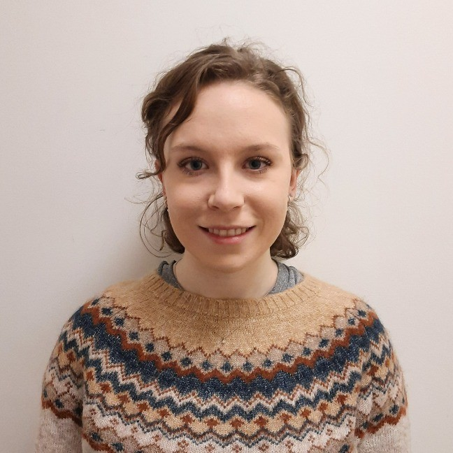

## Hackathon Day 1 Kickoff!

::::: columns
::: {.column width="60%"}
- Welcome to the Pre-Stats Awayday Hackathon!
- Get ready for two days of hands-on learning, creativity, and collaboration as we tackle real-world challenges together.


:::

::: {.column width="40%"}

:::
:::::


## What to expect
::::: columns
::: {.column width="50%"}
- Over the next two days, you’ll:

    - Work in teams on a project of your choice
    - Build something innovative and useful
    - Present your work here and at the Stats Awayday on 11th September
:::
::: {.column width="50%"}


:::
:::::
## Your presentation

::::columns
::: {.column width="60%"}
-   We provided a guided structure to help you create your presentation so no need to start from scratch!

- Your presentation should be 5 to 10 minutes total, including time for questions. 

    - Aim for around 7–8 minutes of presenting, leaving 2–3 minutes for Q&A.

- At least one team member must be available to present:

    - At the end of the hackathon
    - And again at the DfE Stats Awayday on 11th September
:::
::: {.column width="40%"}

:::
::::
## Meet the volunteers {.smaller}

::: panel-tabset


### Technical volunteers
::: {layout-nrow=3}

{fig-align="left" width=40%}

{fig-align="left" width=40%}

{fig-align="left" width=40%}

{fig-align="left" width=40%}

{fig-align="left" width=40%}

{fig-align="left" width=40%}

{fig-align="left" width=40%}
:::


### Data background / Subject expert volunteers

::: {layout-ncol=2}

{fig-align="left" width=50%}

{fig-align="left" width=50%}

:::
:::


## Your teams and projects


::: panel-tabset

## Persistent Absence Explorer

::::columns
::: {.column width="40%"}
### Persistent Absence Explorer

This project aims to make it easier to analyse and compare persistent absence rates across regions and school types, using the Week 29 dataset for a full-year view. The goal is to uncover meaningful patterns and insights.

:::
::: {.column width="60%"}

| **Team member**             | **Location** |
|-----------------------------|--------------|
| Robert TARRANT              | London       |
| Finn TRINCI                 | London       |
| April WORRALL               | Sheffield    |
|Matt WELLER|London|
| Hasan MALIK                            | Coventry     |
:::
::::

## Automated QA of SPC/SEN

::::columns
::: {.column width="40%"}
### Automated QA of SPC/SEN

This project aims to streamline the manual cross-checking of school census data used in the Schools, Pupils, and their Characteristics (SPC) and Special Educational Needs (SEN) publications. Automating the QA process will save time, reduce errors, and enable earlier data visualisation to spot trends.
:::
::: {.column width="60%"}
| **Team member** | **Location** |
|-----------------------------|--------------|
| Kester JARVIS | Wed: MS Teams. Thurs: London|
| Nathan CHALAM-JUDGE | Sheffield |
|Josie BRETT | MS Teams |
|Mark HORTON| MS Teams|
|Matthew ROLFE|Sheffield|
|Ricardo HAYWARD|London|

:::
::::


## Using LLMs for Third-Line QA on Statistical Releases
::::columns
::: {.column width="40%"}
### Using LLMs for Third-Line QA on Statistical Releases

This project explores whether large language models (LLMs) can help spot patterns, anomalies, or inconsistencies in statistical data that traditional QA might miss, adding an extra layer of assurance and insight.
:::
::: {.column width="60%"}

| **Team member**                                      | **Location** |
|-----------------------------|--------------|
| Jake TUFTS                           | London       |
| Rebecca WEDGE-ROBERTS    | Sheffield    |
|Gemma SELBY|MS Teams|
|Daniel DODGSON| MS Teams|
|Cheena GHATAOURA| London|
:::
::::
## Developing a Historical School Identifier Dimension

::::columns
::: {.column width="40%"}
### Developing a Historical School Identifier Dimension

This project aims to create a consistent way to track schools over time, despite changes in identifiers like URN and LAESTAB due to closures or mergers. A historical link between identifiers will support better longitudinal analysis.
:::
::: {.column width="60%"}
| **Team member**                                     | **Location** |
|-----------------------------|--------------|
| Connor BOUSFIELD                                    | Darlington   |
| Samuel PILLING                                      | London       |
| Sema TAYAR                                         |London              |
| Matthew ROBINSON |London|
|James TIERNEY|MS Teams|
| Sarah M-BRIGHT           | London       |

:::
::::
:::

## Presentation schdule




## Hackathon Participant Guide

::::: columns
::: {.column width="60%"}

:::callout-important
Check your file to make sure it matches your project — look for the project name next to the title
:::

- Sent via email and available in MS Teams → Files tab
- Includes:

    - Agenda & room bookings
    - Code of conduct
    - Project info
    - Data access
    - Planning templates (Miro, Lucid, Trello)
    - GitHub links
    - Support resources
    - Presentation guidance
:::

::: {.column width="40%"}

:::
:::::


## Code of conduct

:::::: columns
:::: {.column width="40%"}
- The code of conduct is linked in the ‘Event Overview’ section of your participant guide
- Please read it carefully before getting started
- We’re committed to creating a friendly, inclusive, and welcoming environment for everyone
- Following the code helps ensure a positive experience for all participants

::::

::: {.column width="60%"}

:::
::::::

## Agenda

::::: columns
::: {.column width="40%"}
- The agenda for both days is available via the clickable tabsets in your guide
- See which rooms are booked for each location across both days
- View the session schedule for each day, including:

    - Session details
    - MS Teams links for main sessions and drop-in sessions
:::

::: {.column width="60%"}

:::
:::::

## 📅 Day 1: 3rd September 2025


{fig-align="center"}

## Data, tools and collaboration 

::::: columns
::: {.column width="60%"}
- The 'Data and tools' section in your guide provides:

    - Links to data you need
    - Tools for project planning and collaboration (Miro, Lucid, Trello)
    - GitHub repository links for code sharing and documentation
:::
::: {.column width="40%"}

:::
:::::

## Getting help
::::columns
::: {.column width="60%"}
-   Use the 'Support available' section in your guide to find links to resources
-   Use the [Pre-stats awayday hackathon group](https://teams.microsoft.com/l/team/19%3AmDwTrFC1t5hhuDsXfajF516hmOWTFGjgIvJcPjdCLNM1%40thread.tacv2/conversations?groupId=620ed7ec-9dc9-4ca1-bc7b-848f6bd80878&tenantId=fad277c9-c60a-4da1-b5f3-b3b8b34a82f9) on Teams to ask questions.
-  Come to the drop-in sessions if you have a query that hasn't been picked up over teams.
:::
::: {.column width="40%"}

:::
::::

## Teams Channels and notifications 


::: {layout-ncol=2}


:::

## MS Teams Message Structure 
::::columns
::: {.column width="60%"}
-   Use the MS Teams channel to ask questions and get help from the organisers and volunteers.
-   Select the relevant channel for your query.
-   Provide the following so the volunteers can help you:

    -   Your project name
    -   A summary of the issue you are facing
    -   Any error messages you are getting
    -   Minimal reproducible example to recreate your error if applicable 

:::
::: {.column width="40%"}

:::
::::   


## Let's get started!

::::columns
::: {.column width="50%"}

Here is a check list to help you: 

1.  Set up a teams chat with your team

2.  Set up a call with your team to plan your project

3.  Decide on your project planning tool

4.  Complete the 'Meet your team!' activity. You will find it on the Miro and Lucid boards or a link to a modified version if you choose Trello instead.
:::
::: {.column width="50%"}

::: callout-tip
## Things to consider:

```         
-   Project planning tools

-   The coding language you will use

-   Break down the project and assign parts to different members

-   How you can utilize different people's expertise while still pushing for development

-   Make sure to set up calls for the team check-ins scheduled in the agenda
```
:::
:::
::::

