## Hackathon Day 1 Kickoff!

-   Welcome to the Pre-Stats Awayday Hackathon!
-   Get ready for two days of hands-on learning, creativity, and collaboration as we tackle real-world challenges together.

::: notes
-   Thank you for joining us today and tomorrow for the hackathon.
-   Introduce myself and my role in the hackathon
-   These projects have been suggested by colleagues across the DfE including ESLG members
:::

## What to expect

::::: columns
::: {.column width="50%"}
-   Over the next two days, you’ll:

    -   Work in teams on a project that solves / helps with a real DfE data challenge
    -   Present your work to other participants and ESLG members at the end of the hackathon (4th September).

-   You will also present your work on the Stats Awayday audience on 11th September.
:::

::: {.column width="50%"}
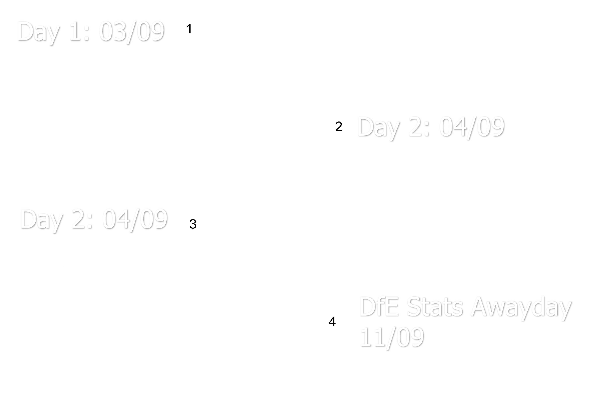
:::
:::::

::: notes
-   You will be working in teams for the next two days on one of four projects that address real DfE data challenges.
-   At the end of the hackathon, each team will present their work to other participants and ESLG members.
-   Additionally, teams will present their projects at the Stats Awayday on 11th September. Please ensure that at least - one (ideally two) team members are available to present on both occasions.
-   I will ask you before you present about who will be available to present on the stats awayday
:::

## Agenda

::::: columns
::: {.column width="40%"}
-   The agenda for both days is available via the clickable tabsets in your guide

-   See which rooms are booked for each location across both days

-   View the session schedule for each day, including:

    -   Session details
    -   MS Teams links for main sessions and drop-in sessions
:::

::: {.column width="60%"}
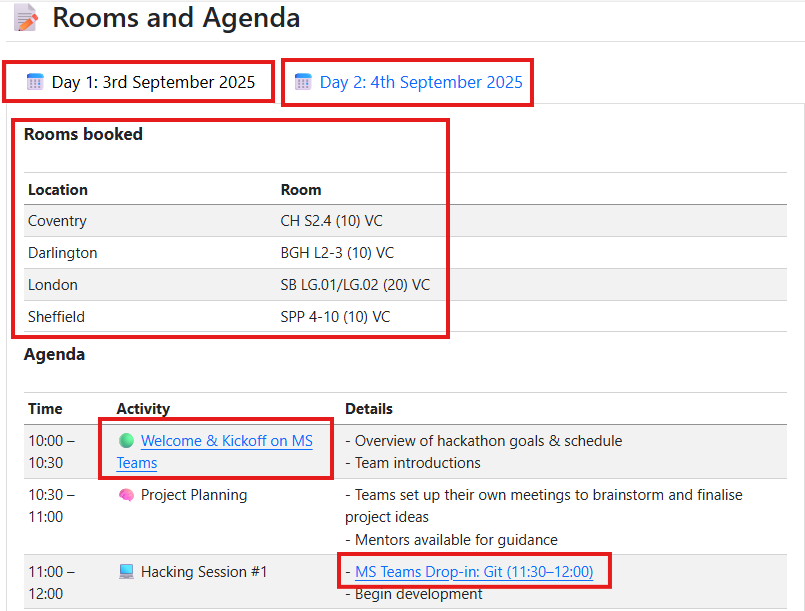
:::
:::::

:::{.notes}
-   The agenda is available in your participant guide and also on the files tab in the MS Teams group
-   You can see which rooms are booked for each location across both days
-   You can view the session schedule for each day, including session details and MS Teams links for main sessions and drop-in sessions
- Only go to the drop in session if they apply to your project and if you have questions that have not been answered in the teams group
:::

## 📅 Day 1: 3rd September 2025

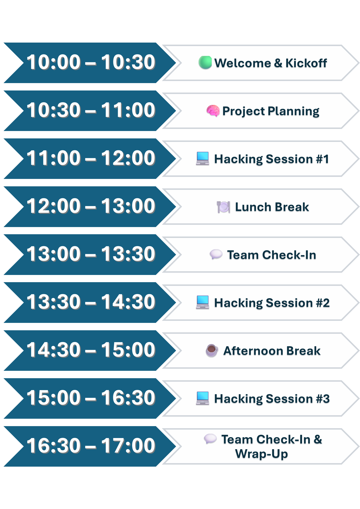{fig-align="center"}

::: notes
-   Today you will get to know your team have time to plan your approach.
-   You will have hacking sessions which are dedicated time for you to work on your project.
-   There are also drop-in sessions where you can get help from the volunteers if you have any questions or need support.
- You have slots in the agenda for team checks in so you can update your teammates on progress and decide on your next steps. Make sure to set up your own team meetings for these. 
- I want to highlight the one at the end of the day as this is a good opportunity to reflect on what you have achieved today and plan for tomorrow.
- There is also scheduled time for lunch and an afternoon break. We do recommend you take breaks to help you stay focused and productive.
:::

## Your presentation

::::: columns
::: {.column width="60%"}
-   We provided a guided structure to help you create your presentation so no need to start from scratch!

-   Your presentation should be 5 to 10 minutes total, including time for questions.

    -   Aim for around 7–8 minutes of presenting, leaving 2–3 minutes for Q&A.

-   At least one team member must be available to present:

    -   At the end of the hackathon on the 4th September
    -   The DfE Stats Awayday on the 11th September
:::

::: {.column width="40%"}

:::
:::::

::: notes
-   Structure of presentation is provided in your pack at the bottom.
-   Timing is really important for the presentations as we're tight on time on the awayday
-   Tomorrow you can practice and refine your timing.
-   We linked the DfE quarto template we have on GitHub in the participant guide and you can use that for the presentation. In, fact I'm using it now. You can alternatively use powerpoint
- After the presentation, we will have time for all of you to vote for best innovative project and best presentation. Voting will also happen on the awayday!
:::

## Presentation schedule



::: notes
-   Here is the presentation schedule for tomorrow
-   Each team will have 10 minutes to present and answer questions from the audience
-   We will not need 10 minutes for voting most likely but just in case technical issues happen! 
-   Then we will have closing remarks
-   Please let me know if this schedule does not work for your team and I will try to shift timings around. Please let me know this ASAP.
:::

## Your teams and projects

::::::::::::::: panel-tabset
## Automated QA of SPC/SEN

::::: columns
::: {.column width="40%"}
### Automated QA of SPC/SEN

This project aims to streamline the manual cross-checking of school census data used in the Schools, Pupils, and their Characteristics (SPC) and Special Educational Needs (SEN) publications. Automating the QA process will save time, reduce errors, and enable earlier data visualisation to spot trends.
:::

::: {.column width="60%"}
| **Team member**     | **Location**                 |
|---------------------|------------------------------|
| Nathan CHALAM-JUDGE | Sheffield                    |
| Josie BRETT         | MS Teams                     |
| Mark HORTON         | MS Teams                     |
| Matthew ROLFE       | Mix of virtual and Sheffield |
| Ricardo HAYWARD     | London                       |
:::
:::::

## Developing a Historical School Identifier Dimension

::::: columns
::: {.column width="40%"}
### Developing a Historical School Identifier Dimension

This project aims to create a consistent way to track schools over time, despite changes in identifiers like URN and LAESTAB due to closures or mergers. A historical link between identifiers will support better longitudinal analysis.
:::

::: {.column width="60%"}
| **Team member**  | **Location** |
|------------------|--------------|
| Connor BOUSFIELD | Darlington   |
| Samuel PILLING   | London       |
| Sema TAYAR       | London       |
| Matthew ROBINSON | London       |
| James TIERNEY    | MS Teams     |
| Sarah M-BRIGHT   | London       |
|Zofia Jones| -|
:::
:::::

## Persistent Absence Explorer

::::: columns
::: {.column width="40%"}
### Persistent Absence Explorer

This project aims to make it easier to analyse and compare persistent absence rates across regions and school types, using the Week 29 dataset for a full-year view. The goal is to uncover meaningful patterns and insights.
:::

::: {.column width="60%"}
| **Team member** | **Location** |
|-----------------|--------------|
| Robert TARRANT  | London       |
| Finn TRINCI     | London       |
| April WORRALL   | Sheffield    |
| Matt WELLER     | London       |
| Hasan MALIK     | Coventry     |
:::
:::::

## Using LLMs for Third-Line QA on Statistical Releases

::::: columns
::: {.column width="40%"}
### Using LLMs for Third-Line QA on Statistical Releases

This project explores whether large language models (LLMs) can help spot patterns, anomalies, or inconsistencies in statistical data that traditional QA might miss, adding an extra layer of assurance and insight.
:::

::: {.column width="60%"}
| **Team member**       | **Location** |
|-----------------------|--------------|
| Jake TUFTS            | London       |
| Rebecca WEDGE-ROBERTS | Sheffield    |
| Gemma SELBY           | MS Teams     |
| Daniel DODGSON        | MS Teams     |
| Cheena GHATAOURA      | London       |
:::
:::::
:::::::::::::::

:::notes
-   Here are the four projects you will be working on over the next two days
-   Each team has a mix of locations and the information on the screen is what I had from the form you filled in to confirm your place but that may have changed so make sure you communicate with your team and decide on how you will work together
- Now to remind ourseleves of the projects and who is assigned to each team
:::

## Hackathon Participant Guide

-   Check your file to make sure it matches your project — look for the project name next to the title
-   Sent via email and available in MS Teams → Files tab
-   Contains all the info you need for the hackathon
-   Can be navigated easily through the table of contents at the right hand side

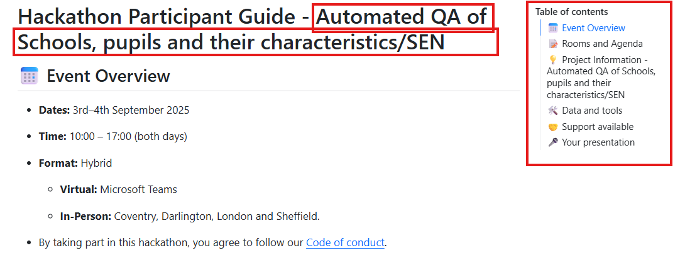

::: notes
-   Includes:

    -   Agenda & room bookings
    -   Code of conduct
    -   Project info
    -   Data access
    -   Planning templates (Miro, Lucid, Trello)
    -   GitHub links
    -   Support resources
    -   Presentation guidance
:::

## Code of conduct

::::: columns
::: {.column width="40%"}
-   The code of conduct is linked in the ‘Event Overview’ section of your participant guide
-   Please read it carefully before getting started
-   We’re committed to creating a friendly, inclusive, and welcoming environment for everyone
-   Following the code helps ensure a positive experience for all participants
:::

::: {.column width="60%"}
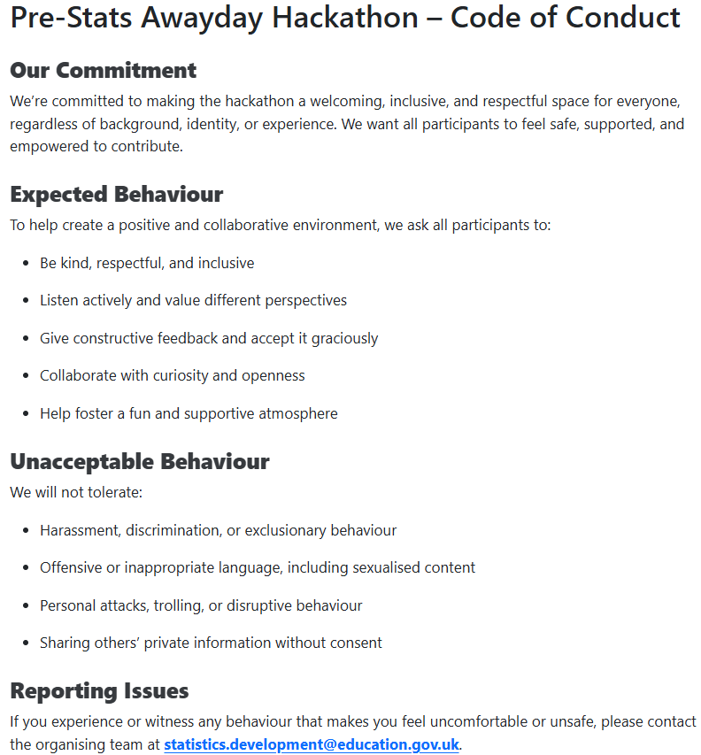
:::
:::::

## Data, tools and collaboration

::::: columns
::: {.column width="60%"}
The 'Data and tools' section in your guide provides:

-   Links to data you need
-   Tools for project planning and collaboration (Miro, Lucid, Trello)
-   Link to your GitHub repository
:::

::: {.column width="40%"}

:::
:::::

::: notes
-   Data is publicly available on EES for all projects. You can download the CSVs from the EES website or use the EES API (link in the guide) to pull the data.

-   Make sure to pick a project planning tool that suites you best.

-   You may need to create an account for your team's preferred tool if you don't already have one.

-   If your team doesn't have a Lucid licence, you may struggle to use all the features provided so we recommend trello or miro in that case.

- You can also choose other project planning tools if that is what suites your teams needs

-   The links provided for the project planning tools are templates and we gave instructions on how to duplicate these templates so you can use them for your team.

-   You will have recieved an email notification about being added to your GitHub repo for your hackathon project. We also included the link to that repo in your pack.
:::

## Getting help

::::: columns
::: {.column width="60%"}
-   Use the 'Support available' section in your guide to find links to resources
-   Use the [Pre-stats awayday hackathon group](https://teams.microsoft.com/l/team/19%3AmDwTrFC1t5hhuDsXfajF516hmOWTFGjgIvJcPjdCLNM1%40thread.tacv2/conversations?groupId=620ed7ec-9dc9-4ca1-bc7b-848f6bd80878&tenantId=fad277c9-c60a-4da1-b5f3-b3b8b34a82f9) on Teams to ask questions.
-   Come to the drop-in sessions if you have a query that hasn't been picked up over teams.
:::

::: {.column width="40%"}

:::
:::::

::: notes

- Make sure to utilise the information we gave you in the pack for support like background information on publications, EES API documentation, guidance around using LLMs in DfE, packages and templates like dfeR and our shinydashboard template. 

- Use the pre-stats awayday hackathon group on teams to post questions and we also encourage you to answer questions from other participants.

- Please be patient and respectful to our volunteers. They may not be able to get back to you right away but we have a few tips for you to help them find your messages.

:::

## Teams Channels and notifications

::: {layout-ncol="2"}
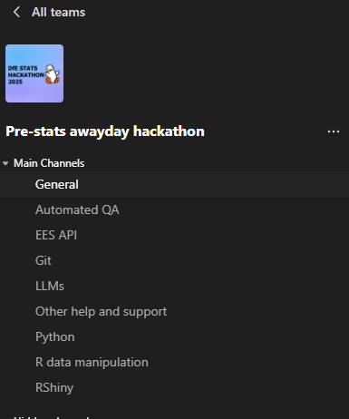

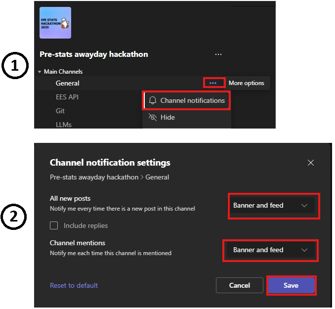
:::

::: notes

- Make sure to post your questions in the relevant teams channel in the group
- Make sure you turn on notifications for the General channel so you dont miss any updates 
- Also turn on the notifications for other channels relevant to your project

:::

## MS Teams Message Structure

::::: columns
::: {.column width="60%"}
-   Use the MS Teams channel to ask questions and get help from the organisers and volunteers.

-   Select the relevant channel for your query.

-   Provide the following so the volunteers can help you:

    -   Your project name
    -   A summary of the issue you are facing
    -   Any error messages you are getting
    -   Minimal reproducible example to recreate your error if applicable
:::

::: {.column width="40%"}
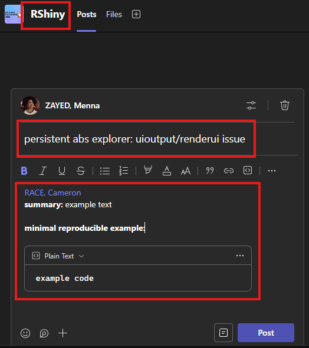
:::
:::::

:::notes

- Make sure to structure your messages in a clear way to help our voluteers assist you
- Make sure you mention what project you're working on and include a summart of the issue you're facing.
- Make sure you include screenshots of the errors you're encountering
- Include a minimal reproducible example to recreate your error if applicable.
- if you are not familair with minimal reproducible examples, please look in your guide and you will be a link to a website called stackoverflow that explains what they are.

:::

## Meet the volunteers {.smaller}

::::: panel-tabset
### Technical volunteers

::: {layout-nrow="3"}
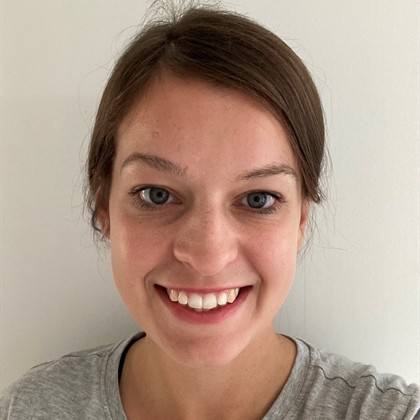{fig-align="left" width="40%"}

{fig-align="left" width="40%"}

{fig-align="left" width="40%"}

{fig-align="left" width="40%"}

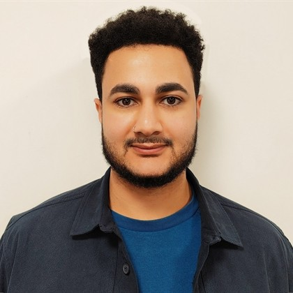{fig-align="left" width="40%"}

{fig-align="left" width="40%"}

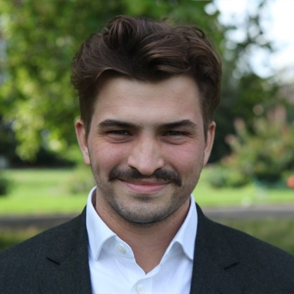{fig-align="left" width="40%"}

:::

### Data background / Subject expert volunteers

::: {layout-nrow="2"}
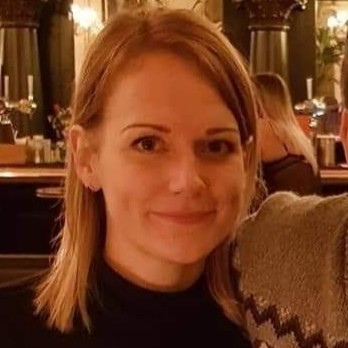{fig-align="left" width="50%"}

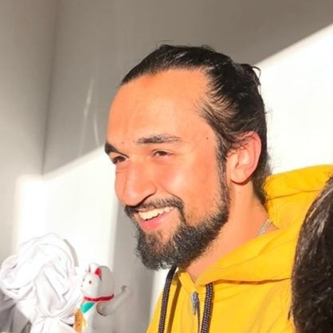{fig-align="left" width="50%"}

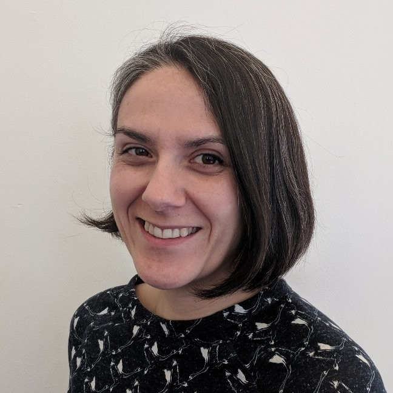{fig-align="left" width="50%"}

{fig-align="left" width="50%"}
:::
:::::

::: notes

- Massive thank you to all our volunteers.
- The people on the screen right now are our lead volunteers for technical areas 
- The leads will be running the drop in sessions today and tomorrow except for Mo as Python is too general of an area so you can drop him messages if you need support and he can provide guidance and support. 
- Ed and his team have limited availability so they will be doing a demo session right after this for the Using LLMs for third line QA team today but may not be available for the other drop in sessions.
- The drop-in sessions will be focused on questions you bring to the volunteers during those sessions. Focus on queries that are more he;pful to talk through than post on teams.
- We don't expect our volunteers to know all the answers so you shouldn't either! They may sign post you to someone else who may know the answer and they may need time to fidn answers and get back to you.
- We also have support volunteers for our lead technical experts and you can find their names in your pack
- If you have questions, we do encourage you to post them in the MS Teams group in the relevant channels while tagging the relevant volunteers so one of them can pick it up.
- Then we have our data expert volunteers 

:::

## 'Meet the team' activity

::::: columns
::: {.column width="60%"}
-   We planned a short activity so that you and your team get to know each other.
-   If you choose to use Lucid or Miro, the activity is included as part of the board.
-   It is not on the Trello board templates, but we linked a modified version of it so that your team can still take part if you want to choose Trello or other project plannning tools.
:::

::: {.column width="40%"}
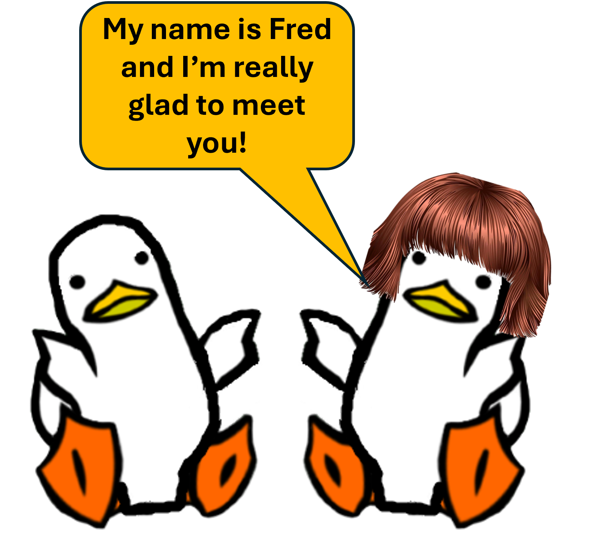
:::
:::::

## Things to consider

::::: columns
::: {.column width="60%"}
-   Project planning tools that suit your team

-   The coding language you will use

-   How you will break down the project and assign parts to different members

-   How you can utilize different people's expertise while still pushing for development

-   Make sure to set up calls for the team check-ins scheduled in the agenda
:::

::: {.column width="40%"}

:::
:::::

## Let's get started!

::::: columns
::: {.column width="50%"}
Here is a check list to help you:

-   [ ] Set up a teams chat with your team

-   [ ] Set up a call with your team to plan your project

-   [ ] Decide on your project planning tool

-   [ ] Complete the 'Meet your team!' activity. You will find it on the Miro and Lucid boards or a link to a modified version if you choose Trello instead.
:::

::: {.column width="50%"}

:::
:::::
