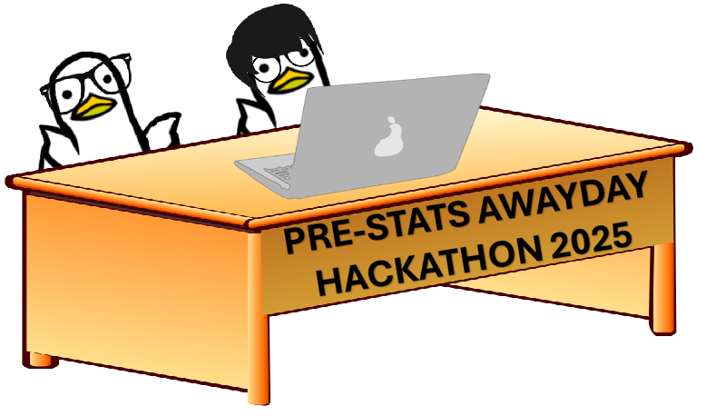
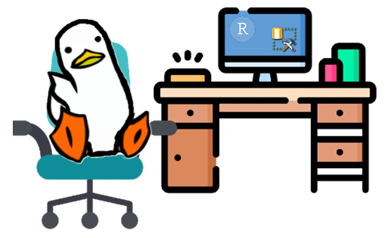
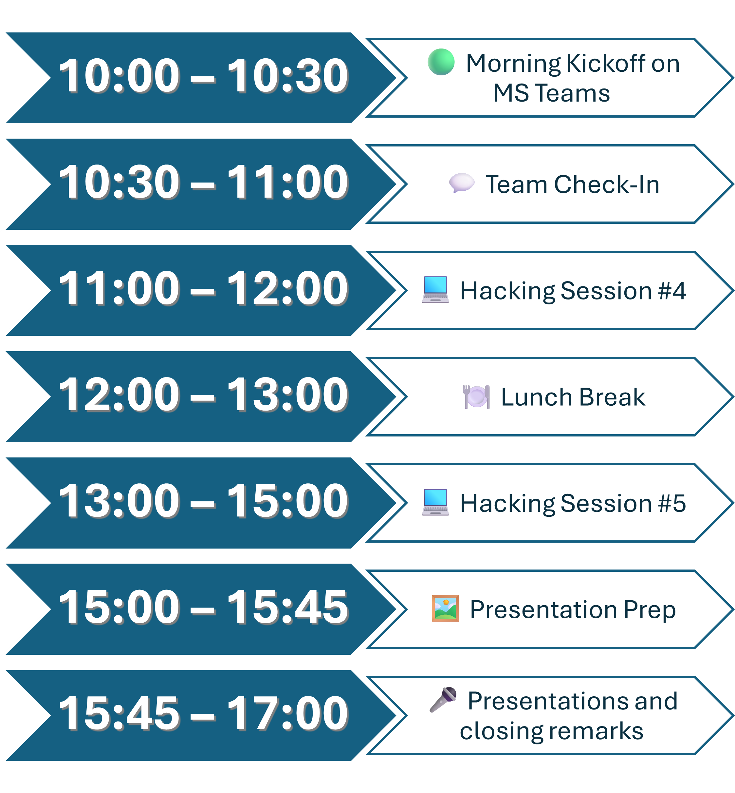
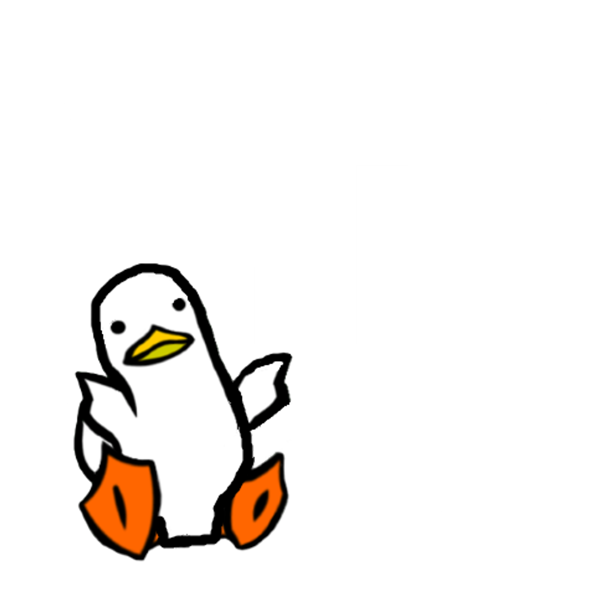
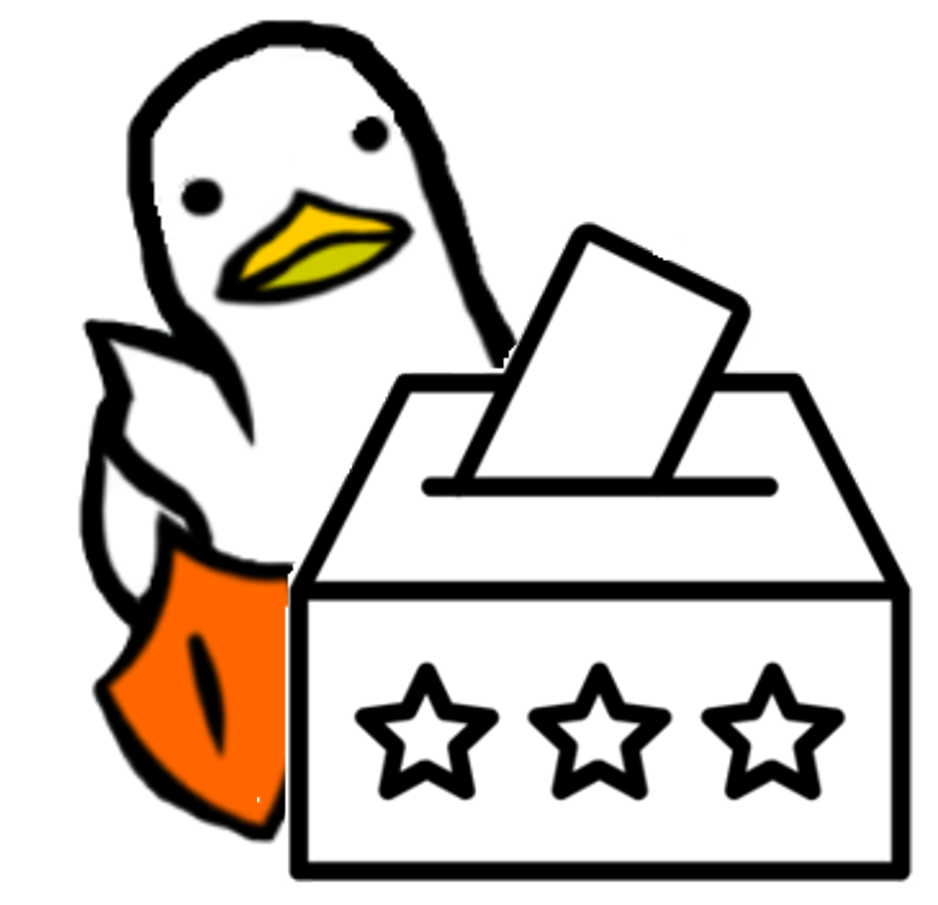
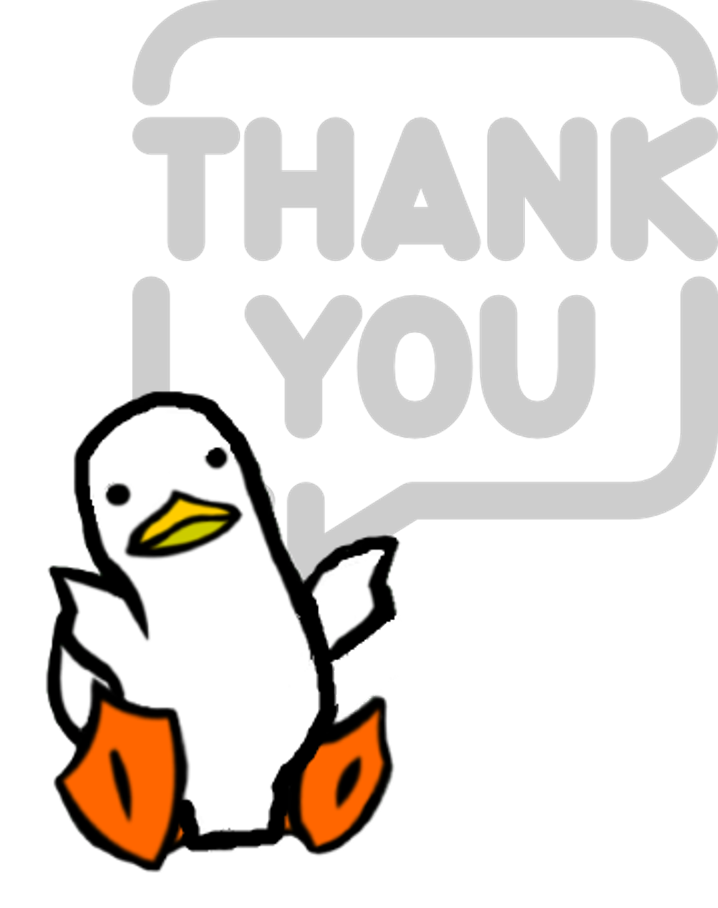

## Hackathon Day 2 Kickoff!

::::: columns
::: {.column width="60%"}
-   Welcome back to Day 2 of the Pre-Stats Awayday Hackathon!
-   We hope you had a productive Day 1 and are ready to dive back into your projects.
:::

::: {.column width="40%"}

:::
:::::

## Recap of day 1

-   Project planning ✅
-   Data access and tool setup ✅
-   Initial coding and development ✅

## Goals for today

::::: columns
::: {.column width="60%"}
-   Finalize your projects

    -   Finalise building and testing your prototype
    -   Make sure your code is on the GitHub repo
    -   Make sure you have a detailed README file in your repo

-   Prepare your presentations

-   Present your work at the end of the day
:::

::: {.column width="40%"}
{figure-align="center"}
:::
:::::

## Agenda for Day 2

{figure-align="center"}

## Presentation schedule



# Presentation Tips

## Keep it concise:

::::: columns
::: {.column width="60%"}
-    5 to 10 minutes total, including time for questions.
-   Aim for around 7–8 minutes of presenting, leaving 2–3 minutes for Q&A.
    
:::

::: {.column width="40%"}
{figure-align="center"}
:::
:::::

## Focus on key insights    
::::: columns
::: {.column width="60%"}

-   Highlight the most important aspects of your project.
-   What problem does it solve?
-   What was your approach?
-   What are the key features?
-   What are the results?
:::

::: {.column width="40%"}
{figure-align="center"}
:::
:::::

## Use visuals
::::: columns
::: {.column width="60%"}
You can use visuals to enhance your presentation including:

  - Screenshots
  - Charts
  - Code snippets 
  
:::

::: {.column width="40%"}
{figure-align="center"}
:::
:::::
## Practice and be ready for questions
::::: columns
::: {.column width="60%"}

- Rehearse your presentation to ensure smooth delivery.

- Anticipate questions and prepare answers in advance.
:::

::: {.column width="40%"}
{figure-align="center"}
:::
:::::
## Email your slides to Menna
::::: columns
::: {.column width="60%"}

-   Make sure to email your slides to the Statistics Development mailbox by end of day today so we can prepare for the Stats Awayday.
- [Statistics.DEVELOPMENT@education.gov.uk](mailto:Statistics.DEVELOPMENT@education.gov.uk)
:::

::: {.column width="40%"}
{figure-align="center"}
:::
:::::

## Let's Get Started!

-   Set up a Teams meeting for your Team check-in
-   This will be followed by 'Hacking session #4' where you can continue development with drop-in sessions available.

## Presentation schedule



## Voting

:::: columns
::: {.column width="60%"}

-   Use the [Microsoft Form](https://forms.office.com/e/2z86g10qBx) to vote for your favourite projects for each category.

-   Best innovative project: Demonstrates innovation in the technology and or the data used.

-   Best Presentation/Demo: Clear, engaging, and professional delivery of the project.
:::
::: {.column width="40%"}

:::
::::

## Thank you!
::::: columns
::: {.column width="60%"}
-   Thank you for your hard work and creativity over the past two days!
-   We hope you enjoyed the hackathon and learned something new.
-   We look forward to seeing your projects at the Stats Awayday on 11th September.
-   Please remember to email your slides to Menna by the end of today.
-   We value your feedback! Please take a moment to fill out our [feedback form](https://forms.office.com/e/EpyYsqPaZx).
:::
::: {.column width="40%"}

:::
:::::

