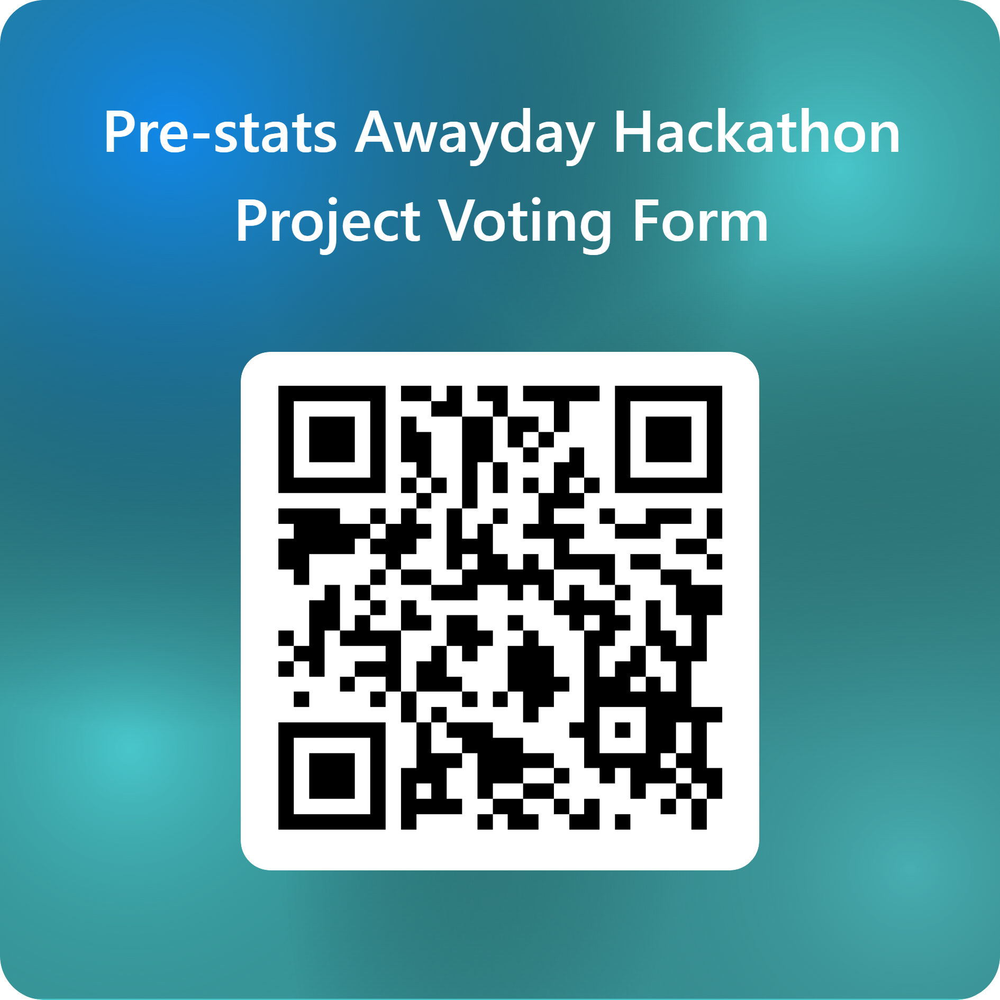

## Hackathon Background
:::: columns
::: {.column width="60%"}
- On the 3rd-4th September, we hosted a 2-day Hackathon.
- This event was open to everyone in DfE with all skill levels.
  
    - We wanted this to be a chance for people to upskill and network
    
- Teams worked on 4 projects that were proposed by colleagues across the department looking for innovative solutions to real-world problems.
- Today these teams will present what they built, how they did it, and answer your questions.
:::
::: {.column width="40%"}

:::
:::::

:::notes
- On the 3rd-4th September, we hosted a 2-day Hackathon.
- This event was open to everyone in DfE with all skill levels.
    - We wanted this to be a chance for people to upskill and network
- Teams worked on 4 projects that were proposed by colleagues across the department looking for innovative solutions to real-world problems.
- Today these teams will present what they built, how they did it, and answer your questions.

:::

## Presentations Overview
:::: columns
::: {.column width="60%"}

- Each team will present for 5-10 minutes
- Followed by 2-3 minutes for questions
- At the end you will be voting for:

    - Best Innovative Project: Demonstrates innovation in the technology, method, and/or the data used.
    - Best Presentation/Demo: Clear, engaging, and professional delivery of the project.

:::
::: {.column width="40%"}

:::
::::

:::notes

- Each team will present for 5-10 minutes followed by 2-3 minutes for questions.
- At the end you will be voting for:
    - Best Innovative Project: Demonstrates innovation in the technology, method, and/or the data used.
    - Best Presentation/Demo: Clear, engaging, and professional delivery of the project.
    
:::

## Teams and Presentations 

- Automated QA of SPC/SEN
- Developing a Historical School Identifier Dimension
- Persistent Absence Explorer 
- Using LLMs for Third-Line QA on Statistical Releases

:::notes
- Here is the name of the projects and order of presentations.
- Please welcome the automated QA of SPC/SEN team to present first.

:::

## Voting

:::: columns
::: {.column width="60%"}

-   Use the [Microsoft Form](https://forms.office.com/e/2z86g10qBx) to vote for your favourite projects for each category.

-   **Best Innovative Project:** 

    - Demonstrates innovation in the technology, method, and/or the data used.

-   **Best Presentation/Demo:** 
  
    - Clear, engaging, and professional delivery of the project.
:::
::: {.column width="40%"}

:::
::::
